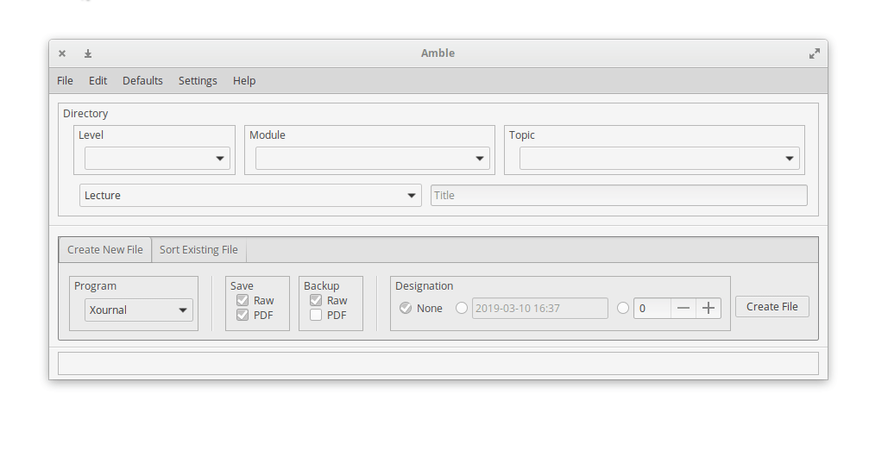
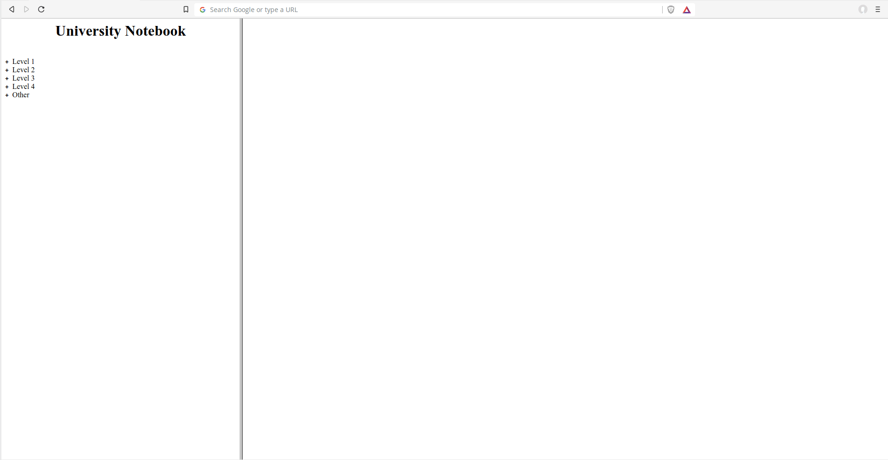

# Amble

A GUI application to create and organise lecture university notes written on a Tablet PC.



## Usage

The application is effectively broken, as it was built for my specific requirements and system at the time. 
For example, this tool presumes that the program [Xournal](https://github.com/xournalpp/xournalpp) is installed, and has been patched to allow for PDF exporting from the command-line.

This was also my first 'major' Python project, and first attempt at a GUI application.

However, it's intended usage at the time was as follows:

- The tool would be filled out with information about the lecture/tutorial/etc (e.g. module name, lecture title, etc.)
- The format of the 'note' to create would be specified, alongside an optional 'designator' (i.e. date or 'lecture number')
- The tool would then create and open the note/file based on a template file for that format. It would be placed in a specific directory and be given a specific name based on the given metadata.
- After the 'note' had been written and closed, the tools would then export the note to PDF and create a backup file (depending on settings given)
- Finally, a 'HTML Notebook' would be generated(/re-generated) to include this latest file.

The 'HTML notebook' could be viewed in a browser and had two panes: a 'tree' pane, and a 'file viewer' pane:



Presuming the tool still works, and the system is configured as the tool expects, it can be started by calling the entrypoint script:

```bash
python src/amble.py
```

## Credits

This application was created using [Quickly](https://wiki.ubuntu.com/Quickly); a now defunct Ubuntu application development tool.

The 'HTML Export' *borrows* heavily from [KeepNote](http://keepnote.org/), an open-source note-keeping tool 
which I used prior to this tool, which is unfortunately unmaintained.

